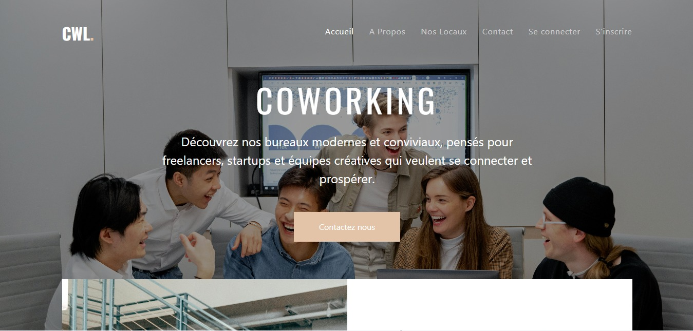

# CWL-Coworking

Développement d’une application web avec React (front-end) et Laravel (back-end) à partir d’un template. Intégration d’API REST et connexion des formulaires à une base de données pour gérer l’enregistrement et la récupération des données. Projet actuellement en cours de développement.

